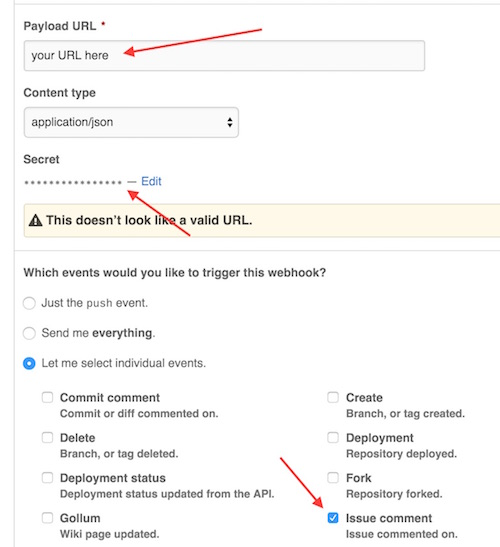

# vote knope


Vote knope solves the plague of +1 comments on GitHub issues.

## Setup

Host vote-knope locally, or remotely:

### Local usage (for testing)

```sh
make setup

# You also need to add this on the webhook on github
openssl rand -hex 32 | pbcopy
export hook_secret=`pbpaste`
export github_user=<USER>
export github_pass=<PASS>
make verify # Check to make sure your env is correct
make serve

# In a different window
make ngrok
```

### Heroku usage

```sh
# Generate a secret for use with the webhook
openssl rand -hex 32 | pbcopy

# Export these env vars on Heroku
hook_secret=<SECRET>
github_user=<USER>
github_pass=<PASS>
```

### Add GitHub webhook

Setup your webhook on GitHub. Be sure to use the secret you created
above otherwise the requests will be ignored. Also be sure to only send
the "Issue comment" webhook event.


